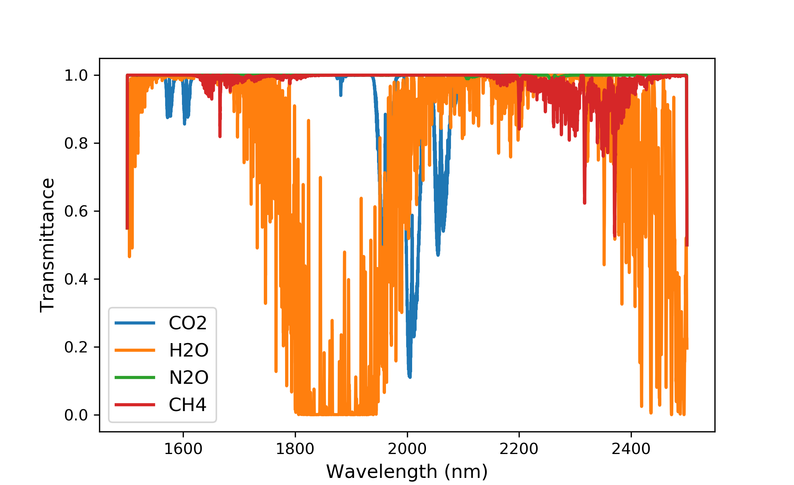

Function Descriptions:

download_data.py: Uses the HAPI toolkit to download absorption line parameters for various gases within a specified spectral range.
main.py: Uses the HAPI toolkit to plot transmittance and optical thickness under the conditions of the 1976 U.S. Standard Atmosphere.
File Description:

tape6_1976: Data sourced from MODTRAN.
Steps:

Run download_data.py.
Run main.py.

